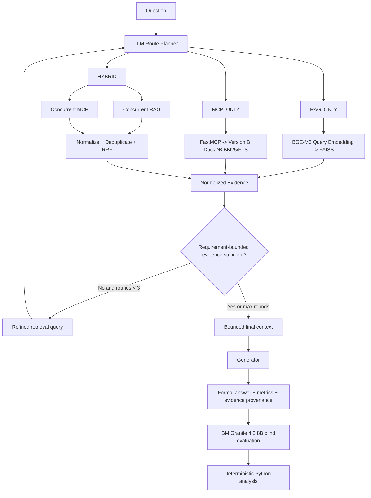

# Architecture

## Module 4 purpose

Module 4 combines two previously frozen telecom knowledge-access systems:

1. **Semantic RAG V1** — BGE-M3 + FAISS
2. **Knowledge-Based MCP** — FastMCP interface over Version B DuckDB BM25/FTS

The experiment asks whether an LLM can select and combine these mechanisms adaptively rather than always using one fixed retrieval path.

## End-to-end architecture

## Retrieval controls

- `top_k = 5` for both RAG and MCP in Module 4
- maximum 3 adaptive rounds
- maximum 5 evidence items presented to the generator
- maximum 2,500 characters per evidence item
- maximum 12,500 context characters
- Hybrid sends the **same query** to RAG and MCP concurrently
- RRF uses `k = 60`
- near-duplicate threshold `0.88`
- post-dedup minimum retriever representation is preserved

## Why RAG and MCP remain separate

RAG and MCP solve different problems:

- **RAG** provides controlled semantic retrieval over a large corpus.
- **MCP** provides a standardized interface to a specialized knowledge service.
- **Hybrid** lets the generator access complementary evidence when one mechanism alone may be insufficient.

MCP is therefore not treated as a competing embedding/retrieval algorithm. The underlying MCP knowledge service still uses the frozen DuckDB BM25/FTS retrieval architecture.

## Formal generation architecture

The generator does not see the hidden benchmark stress label. It receives the question and chooses:

- `RAG_ONLY`
- `MCP_ONLY`
- `HYBRID`

It also produces a retrieval query and answer requirements. After each retrieval round, evidence sufficiency is assessed against those requirements.

The generator may stop early when evidence is sufficient or terminate at `MAX_RETRIEVAL_ROUNDS`.

## Evaluation architecture

Formal generation and independent judging are intentionally separated.

The Granite judge sees only:

- the frozen question;
- final evidence context;
- preserved generator answer.

It does not see:

- generator identity;
- route chosen;
- retrieval-round count;
- generation validation PASS/FAIL;
- latency;
- tokens;
- prior ranking.

This separation reduces operational-metadata leakage into semantic scoring.
